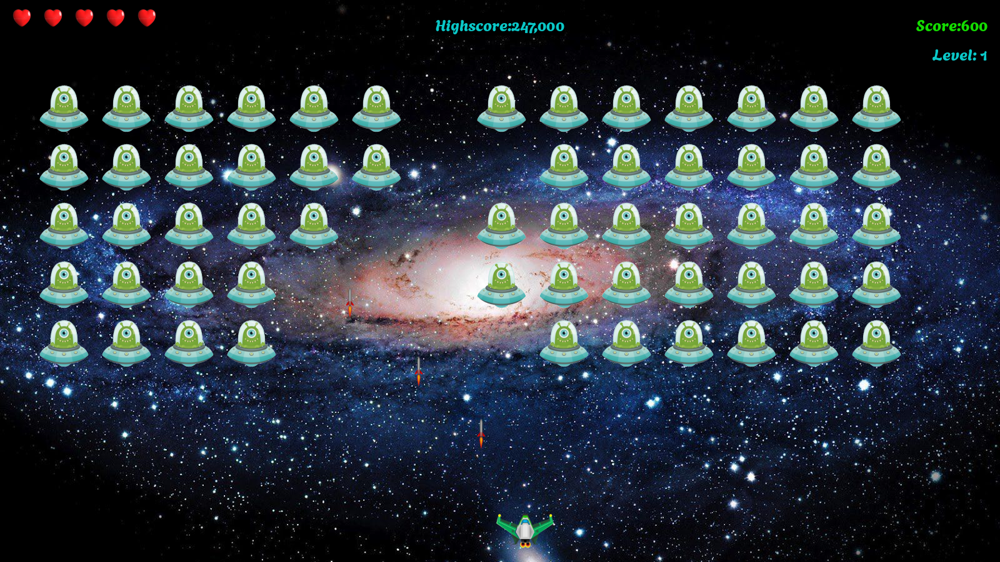

# 2D Game | Alien Invasion | Using Python's Pygame Library

=> Alien shooting game using python.

=> A simple 2D game in which the aim is to shoot down a fleet of aliens as they drop down the screen in levels that increase in speed and difficulty.

=> This game is developed using python's pygame package.

=> Install pygame using pip and execute 'alien_invasion.py' file.
```
pip install pygame
python alien_invasion.py
```
## Game Controls
- **Left Arrow Key:** Move Left
- **Right Arrow Key:** Move Right
- **Spacebar:** Shoot

Here are some screenshots of the game.



