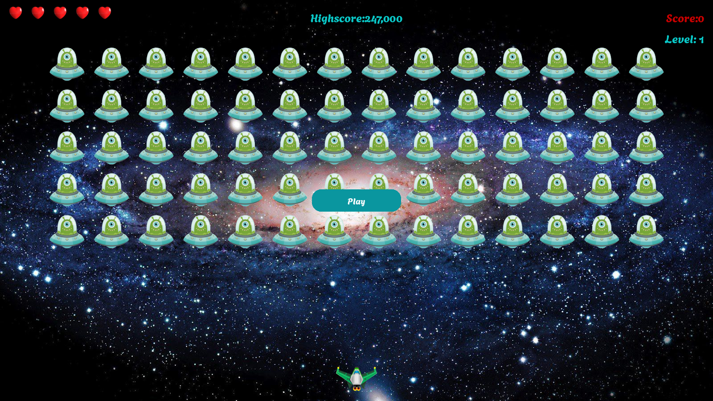

# 2D Game | Alien Invasion | Using Python's Pygame Library

=> Alien shooting game using python.

=> A simple 2D game in which the aim is to shoot down a fleet of aliens as they drop down the screen in levels that increase in speed and difficulty.

=> Game is developed using python's pygame package.

=> We can run the game by executing 'alien_invasion.py' file.

Here are some screenshots of the game.

